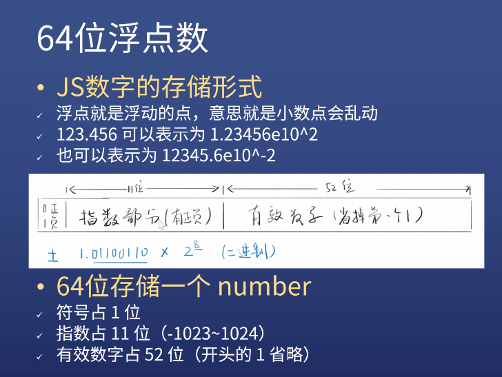

# JS 数据类型 变量声明

- 7 种数据类型
  1. 数字 number
  2. 字符串 string
  3. 布尔 bool
  4. 符号 symbol（几乎不用）
     详情见[方方老师的文章](https://zhuanlan.zhihu.com/p/22652486)
  5. 空 undefined
  6. 空 null
  7. 对象 object
- 总结：四基两空一对象 8. 2020 年 6 月新增：bigint（太新了很少用）  
   详情见[MDN](https://developer.mozilla.org/zh-CN/docs/Web/JavaScript/Reference/Global_Objects/BigInt)

- 以下不是数据
  - 数组、函数、日期
  - 他们都属于 object

## 一、number

- 64 位浮点数

  
_图片来自杭州饥人谷教程_

1. 最大 Number.MAX_VALUE
2. 最小 Number.MIN_VALUE

- 写法
  1. 整数
  2. 小数
  3. 科学计数法
  4. 8 进制
  5. 2 进制
  6. 16 进制
- 特殊情况
  1. 0, 正 0 和 负 0
  2. Infinity, +Infinity, -Infinity
  3. NaN（无法表示的数字）（比如 0/0）  
     (Not a Number)（但是是数字类型）  
     NaN != NaN

## 二、string

每个字符两个字节（阉割版 UTF8）

- 写法

  1. 单引号 ''
  2. 双引号 ""
  3. 反引号 ``
  4. 引号不属于字符串的一部分
  5. 不同引号可以互相包含，相同引号的包含需要转移

- 转义

  1. 'it\'s ok'

- 转义：用另一种写法表示你想要的东西（背）

  1. \' 表示 '
  2. \" 表示 "
  3. \n 表示 换行
  4. \r 表示 回车
  5. \t 表示 tab 制表符
  6. \\\ 表示 \
  7. \uFFFF 表示对应的 Unicode 字符
  8. \xFF 表示前 256 个 Unicode 字符

- 字符串的属性（字符串本没有属性）
  1. string.length 字符串的长度（字节）
  2. string[index] 取字符串中的第 index 个字符  
     index 是从 0 开始的
  3. window.btoa 编码
  4. window.atob 反编码  
     一般用来隐藏招聘启事里的简历邮箱  
     有时候自欺欺人，用来加密，只能骗外行（完全没用）

## 三、bool

- 5 个 falsy 值：相当于 false 但又不是 false 的值
  1.  undefined
  2.  null
  3.  0
  4.  NaN
  5.  ''
- 其他值都是真

## 四、undefined 和 null

1. 本质没有区别
2. 如果一个变量声明了，但没有赋值，默认是 undefined
3. 如果一个函数没有写 return，默认 return undefined
4. 前端程序员习惯上，把非对象空值写为 undefined，把对象的空值写为 null。但仅仅是习惯上而已。

## 五、变量声明

1. 三种声明方式

   1. var a = 1  
      过时的，不好用，不用
   2. let a = 1  
      新的，更合理的方式，变量声明
   3. const a = 1  
      const 是声明时必须赋值，且不能再改的方式，常量声明
   4. a = 1 不要这么写

2. 变量声明在指定值的同时，也指定了数据类型

### 1.let

1. 遵循块作用域，即使用范围不能超出本身所在块{}
2. 同一作用域，不能重复声明
3. 可以赋值，也可以不赋值
4. 必须先声明再使用，否则报错（指的是代码顺序）
5. 全局声明的 let 变量，不会变成 window 的属性
6. for 循环配合 let 有奇效

### 2.const

1. 几乎和 let 一样
2. 但是，声明时必须赋值，有且仅有 1 次赋值，不能改

## 六、类型转换

1. number < -- > string

```javascript
let n = 1;
String(n);
n + "";
```

```javascript
let s = "123";
Number(s);
s - 0;
+s;
parseInt("123");
```

2. 转 bool

```javascript
Boolean(1);
!!1;
!!0;
```

3. 转 string

```javascript
true.toString;
(1).toString;
1..toString;
1 .toString;
```

1.toString 这个会报错，因为 JS 默认 1.后面要加数字，JS 的 bug

4. 看 JS 的奇葩 bug 及解决方法：[JavaScript 秘密花园](https://bonsaiden.github.io/JavaScript-Garden/zh/)
