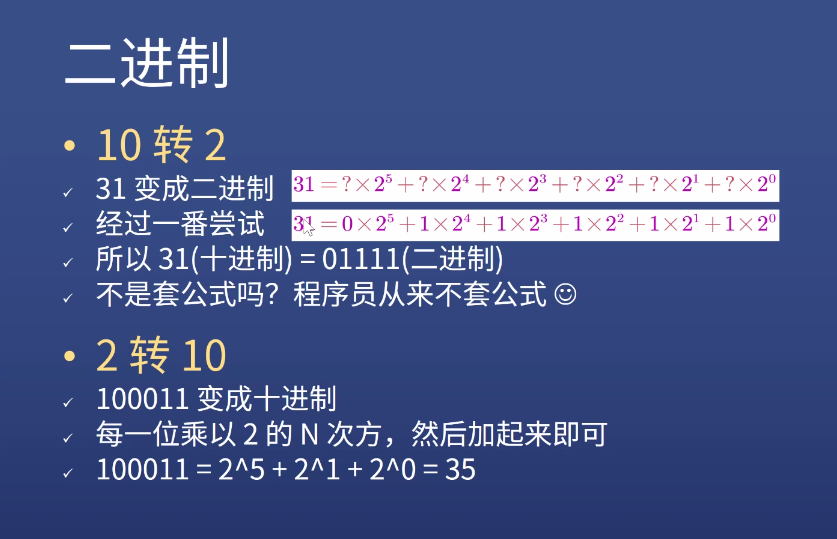
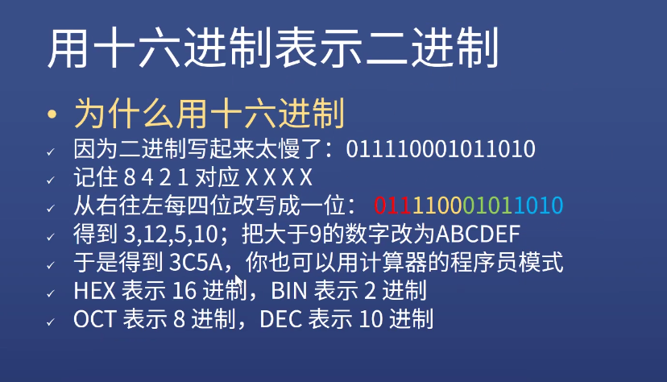
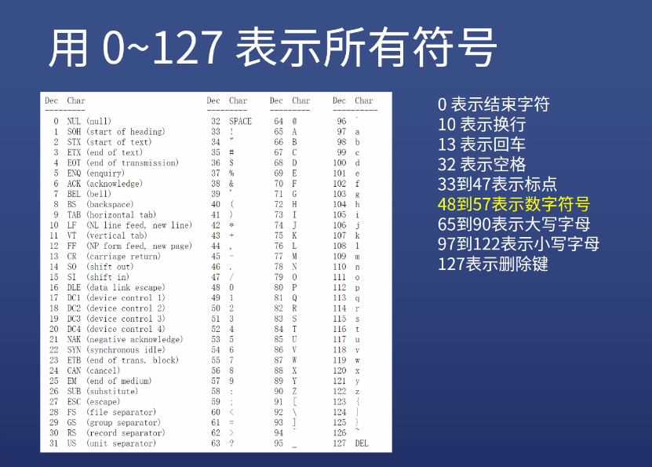
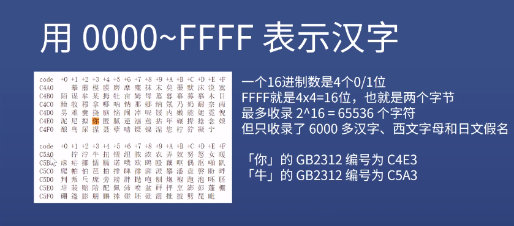

# 数据类型

## 数字与字符串

- 举例：电话号码要用字符串来存（数字不能 0 开头）

## 数字存储方式

1. 进制  
   计算器程序员模式，能直接转换

二进制

十六进制

### 存字符

1. 键盘

0 - 48
A - 65
a - 97

1. 汉字

- 第一版
  16 位（2 字节）

- GBK 国标扩（微软出的）
  16 位（2 字节）

- Unicode 万国码（3 字节）

- UTF-8（变长存法）
  8 - 最低 8 位
